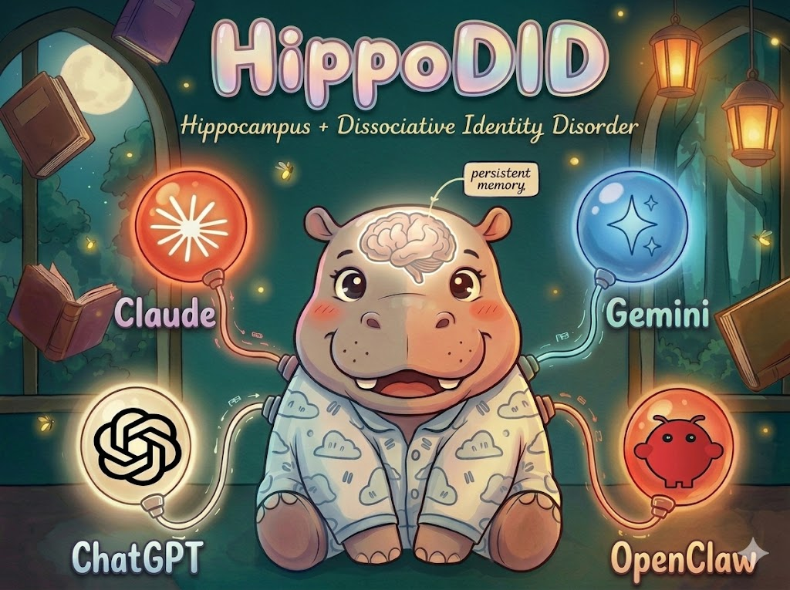

<p align="center">
  
</p>

<p align="center">
  <strong>HippoDid OpenClaw Plugin</strong><br/>
  Persistent cloud memory for OpenClaw. Survives context compaction.
</p>

---

# HippoDid — Cloud Character Memory for OpenClaw

> Your MEMORY.md survives context compaction. Zero-config cloud sync with structured character memory.

## What is HippoDid?

[HippoDid](https://hippodid.com) is persistent, portable memory infrastructure for AI agents. It stores structured memories in a cloud database and retrieves them across sessions, tools, and AI providers. This plugin connects OpenClaw to HippoDid — giving your OpenClaw agent the same memory that Claude Code, ChatGPT, Gemini, Codex, and Cursor can access.

- **Cross-platform recall** — write a memory in OpenClaw, recall it in Claude Code (or vice versa)
- **Survives compaction** — memories are in the cloud, not the context window
- **Structured** — facts are categorized (preferences, skills, decisions) with salience scores and temporal decay
- **Free tier** — 1 character, 100 memories, no credit card required

## The Problem

OpenClaw's own docs warn: **memory dies on context compaction.** Your agent accumulates context over a session — preferences, project knowledge, debugging history. Then compaction triggers, and that context is gone. Next session starts from scratch.

HippoDid syncs your memory files to cloud **before** compaction destroys them. Next session, they're back — automatically.

## Install

```bash
openclaw plugins install @hippodid/openclaw-plugin
```

Coming soon on [ClawHub](https://clawhub.ai) as `hippodid/hippodid-openclaw-plugin`.

Add to your `openclaw.json`:

```json
{
  "plugins": {
    "hippodid": {
      "enabled": true,
      "apiKey": "hd_sk_...",
      "characterId": "my-dev-agent"
    }
  }
}
```

Restart the gateway:

```bash
openclaw gateway restart
```

## Local Dev Install

You can test the plugin locally without publishing to npm:

```bash
npm run build
openclaw plugins install --link .
openclaw gateway restart
openclaw plugins info hippodid
```

That links OpenClaw directly to this working tree, so rebuilding `dist/` updates what the gateway loads.

## How It Works

```
1. Install → Plugin auto-detects your workspace memory directory
2. File watcher → Monitors MEMORY.md + memory/*.md for changes
3. Pre-compaction flush → Syncs to cloud BEFORE context compaction (the critical hook)
4. Session start → Hydrates files from cloud so memory survives across sessions
```

The plugin runs as a **non-slot plugin** — it doesn't replace your existing memory backend. It adds cloud persistence on top of whatever memory system you already use.

## Import Existing Memory

Already have memory files from previous sessions?

```bash
/hippodid import ~/.openclaw/workspace
```

This uploads all `MEMORY.md` + `memory/*.md` files to your HippoDid character in one pass.

## Commands

HippoDid exposes two command surfaces:

1. Chat commands handled by OpenClaw's command router:
   - `/hippodid status`
   - `/hippodid sync`
   - `/hippodid import [workspace-path]`
2. Agent/tool calls available inside the runtime:
   - `hippodid:status`
   - `hippodid:sync`
   - `hippodid:import`

Important: `openclaw agent --message "/hippodid status"` does **not** go through OpenClaw's slash-command router. That path sends the text straight to the agent, so `/hippodid ...` may be interpreted as ordinary user text instead of a plugin command. Use a real OpenClaw chat/channel surface for slash commands, or use the tool forms above for direct agent runs.

## Tool Names

| Tool | Description |
|------|-------------|
| `hippodid:status` | Show tier, sync status, watched paths |
| `hippodid:sync` | Trigger immediate sync of all watched files |
| `hippodid:import` | Import existing workspace memory |

## HippoDid vs Mem0 vs memory-lancedb

| Feature | HippoDid | Mem0 Plugin | memory-lancedb |
|---------|----------|-------------|----------------|
| MEMORY.md sync | Bidirectional cloud sync | Ignores MEMORY.md entirely | Separate vector store |
| Import existing memory | One command, full history | Start from zero | Start from zero |
| Survives compaction | Pre-compaction flush hook | Partial (AUDN capture only) | Local vector DB persists |
| Cross-machine sync | Cloud-based | Mem0 cloud | Local only |
| Data portability | Export to Markdown anytime | Locked in Mem0 format | LanceDB binary format |
| Structured character model | Categories, profiles, decay | Flat user_id memories | Flat key-value |
| Free tier cost | $0 (file sync only, no AI) | Requires OPENAI_API_KEY | Requires embedding API key |
| Multi-agent isolation | Character-scoped by design | Known bleed bug (#3998) | Agent scope option |

## Configuration Reference

```json
{
  "plugins": {
    "hippodid": {
      "enabled": true,
      "apiKey": "hd_sk_...",
      "characterId": "my-dev-agent",
      "baseUrl": "https://api.hippodid.com",
      "syncIntervalSeconds": 300,
      "autoRecall": false,
      "autoCapture": false,
      "additionalPaths": [
        { "path": "./notes/project.md", "label": "project-notes" }
      ]
    }
  }
}
```

| Option | Type | Default | Description |
|--------|------|---------|-------------|
| `apiKey` | string | *required* | HippoDid API key (`hd_sk_...`) |
| `characterId` | string | *required* | Target character ID |
| `baseUrl` | string | `https://api.hippodid.com` | API endpoint |
| `syncIntervalSeconds` | number | `300` | Debounce interval for file sync. The server enforces a tier-based minimum. |
| `autoRecall` | boolean | `false` | Inject relevant memories before each turn (paid tier) |
| `autoCapture` | boolean | `false` | Extract and store facts after each turn (paid tier) |
| `additionalPaths` | array | `[]` | Extra files/directories to watch |

## Free vs Paid Tiers

**Free tier** (no credit card):
- File watcher with SHA-256 diff sync
- Pre-compaction flush (the critical feature)
- Session-start hydration from cloud
- Manual sync and import commands

**Paid tiers** add:
- **Auto-Recall**: Relevant memories injected as context before each agent turn
- **Auto-Capture**: Facts automatically extracted from conversations via AUDN pipeline
- Lower sync interval minimums

If the server reports `autoRecallAvailable` or `autoCaptureAvailable`, the plugin enables those hooks automatically when the matching config flag is `true`.

## Workspace Auto-Detection

The plugin automatically finds your memory files by searching:

1. `$OPENCLAW_WORKSPACE/memory/` and `$OPENCLAW_WORKSPACE/MEMORY.md`
2. `~/.openclaw/workspace/memory/` and `~/.openclaw/workspace/MEMORY.md`
3. Current working directory `./memory/` and `./MEMORY.md`

Add `additionalPaths` in config to watch extra files or directories.

## Requirements

- OpenClaw 2026.1.x+
- Node.js 22+
- HippoDid account (free at hippodid.dev)

## Notes

- The plugin ships compiled output from `dist/` and reads its displayed version from `package.json` at runtime.
- Current HippoDid servers accept `Authorization: Bearer <apiKey>`. The plugin also sends the legacy `X-Api-Key` header for compatibility.
- File sync has been verified locally against a linked OpenClaw install, including watcher-driven sync and cloud status updates.

## License

Apache 2.0
